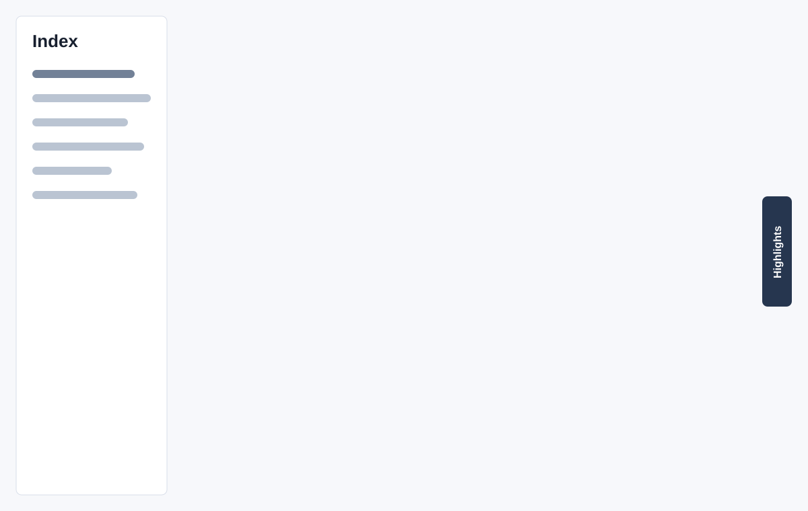

# Sample Output

The committed sample lives at:

```text
Notes/2605_25_31/2605_25_31.json
Notes/2605_25_31/2605_25_31.html
```

It demonstrates the current product shape:

- normalized sibling JSON and HTML filenames
- sticky left index
- compact technical-blog reading layout
- executive summary and sectioned explanations
- public fact-check citation links in Sources
- no visible private Notion source-page link
- selection-based Green / Yellow / Red highlighting
- collapsed right-side highlights review panel
- filename-matched JSON connection for highlight save-back
- interactive test with per-question answer reveal buttons



Regenerate it with:

```bash
npm run render -- Notes/2605_25_31/2605_25_31.json Notes
```

The sample metadata should include:

```json
{
  "htmlFileName": "2605_25_31.html",
  "jsonFileName": "2605_25_31.json"
}
```

The sample keeps `metadata.sourceUrl` blank. Keep it blank for private Notion pages and public sample material.

## Manual Preview

After regenerating, open the HTML and check:

- the left sidebar starts with `Index`
- selecting article text opens Green / Yellow / Red / Clear controls
- the right-side `Highlights` tab starts collapsed
- connecting the matching JSON allows highlight save-back
- each test question has its own answer reveal button
- public citation links are in Sources and no private Notion URL is visible
